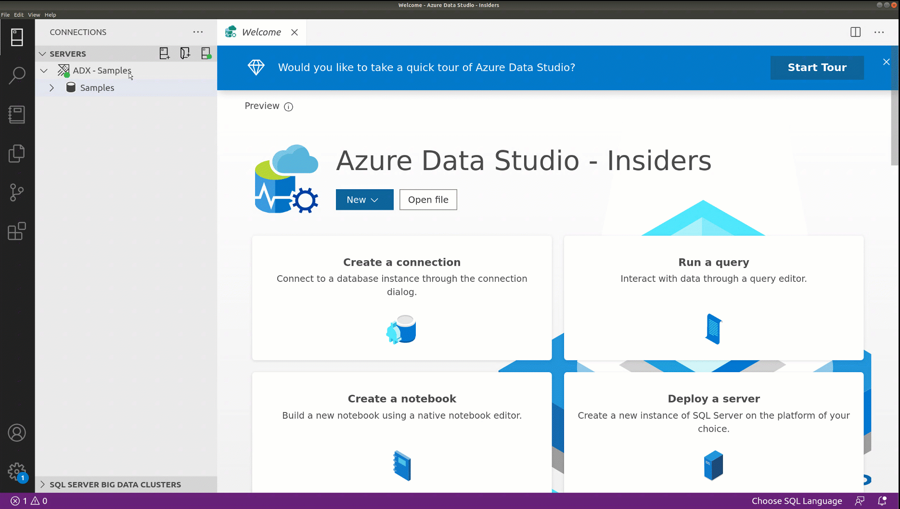
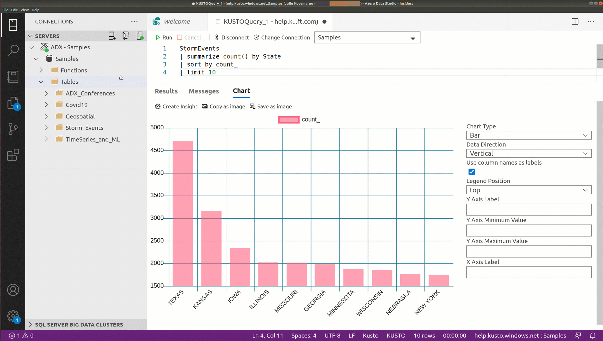

# Kusto (KQL) extension for Azure Data Studio (Preview)

Connect and query Azure Data Explorer (Kusto) clusters and databases with Azure Data Studio, a modern data editor available for Linux, MacOS, and Windows. This extension enables you to interact with Kusto using Azure Data Studio features like:

- Connect to Azure Data Explorer anywhere.
- Searchable object explorer view for database objects.
- Query authoring and editing with Intellisense and syntax highlighting.
- Create a notebook with Kusto.
- View query results and save to CSV, JSON, XML, Excel, or as a chart.

For more information, see the [Kusto extension for Azure Data Studio documentation](https://go.microsoft.com/fwlink/?linkid=2129918).

## Connect to an Azure Data Explorer cluster

You can connect to an Azure Data Explorer cluster with Azure Data Studio.

Select **New Connection** and choose **Kusto** for the **Connection Type**.

Once connected to a cluster, you can start writing a KQL query, run it and a view the results to save it to CSV, JSON, XML, Excel, or as a chart as shown below.

For more information, see [how to create a notebook with the Kusto extension](https://go.microsoft.com/fwlink/?linkid=2129920).

## Create notebooks using the Kusto Kernel

You can run Kusto in a notebook with Azure Data Studio.

Select on **Create notebook** to create a new notebook in Azure Data Studio.

For more information, see [how to create a notebook with the Kusto extension](https://go.microsoft.com/fwlink/?linkid=2129920).

## Contributing to the Extension

This extension lives in the [azuredatastudio repo](https://github.com/microsoft/azuredatastudio) and follows the same guidelines for contribution. If you are interested in fixing issues and contributing directly to the code base, see the document [How to Contribute](https://github.com/Microsoft/azuredatastudio/wiki/How-to-Contribute), which covers the following:

- [How to build and run from source](https://github.com/Microsoft/azuredatastudio/wiki/How-to-Contribute#Build-and-Run-From-Source)
- [The development workflow, including debugging and running tests](https://github.com/Microsoft/azuredatastudio/wiki/How-to-Contribute#development-workflow)
- [Submitting pull requests](https://github.com/Microsoft/azuredatastudio/wiki/How-to-Contribute#pull-requests)

## Peek definitions

## Code of Conduct

This project has adopted the [Microsoft Open Source Code of Conduct](https://opensource.microsoft.com/codeofconduct/). For more information see the [Code of Conduct FAQ](https://opensource.microsoft.com/codeofconduct/faq/) or contact [opencode@microsoft.com](mailto:opencode@microsoft.com) with any additional questions or comments.

## Privacy Statement

The [Microsoft Enterprise and Developer Privacy Statement](https://privacy.microsoft.com/privacystatement) describes the privacy statement of this software.

## License

Copyright (c) Microsoft Corporation. All rights reserved.

Licensed under the [Source EULA](https://raw.githubusercontent.com/Microsoft/azuredatastudio/main/LICENSE.txt)
